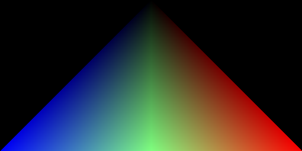
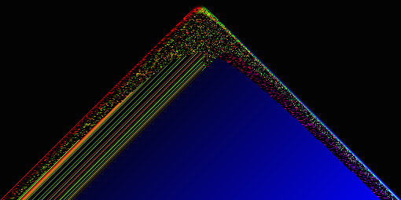
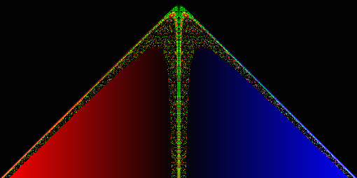
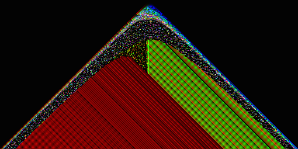
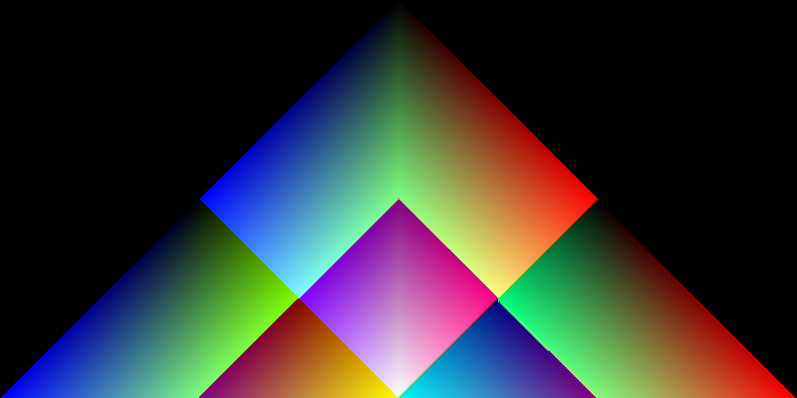

# Mysterious Organic Cellular Automata

I was trying to create a very simple image, a sort of Pascal's triangle but adding RGB values instead of numbers (see the chromatic-pascal-triangle folder).

In the way I got some cool errors:

But the fourth error was different. Out of nowhere, a very complex, organic and beautiful structure emerged (moca0.png).

I did NOT expect that. I was shocked, amazed. I spent the rest of the day playing with the code, but I still can't understand it. Below are some of the most interesting results.

If someone can explain to me what's going on, I'll be really thankful.

PS: I lost the code for moca1, moca2 and moca6. moca0 is just moca3 but smaller.
